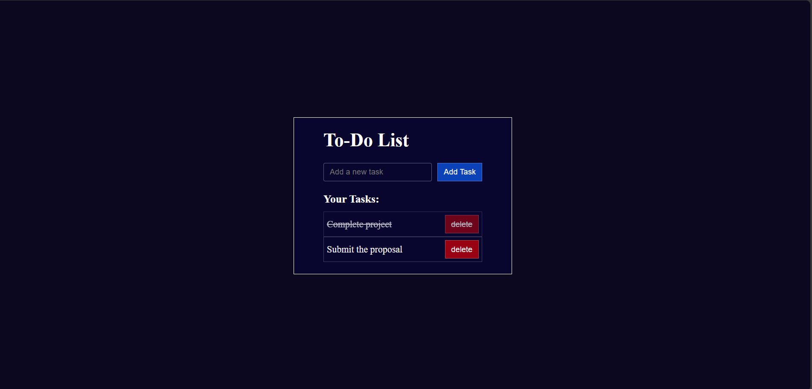

# 📝 Todo List App

A clean and minimal **Todo List application** built using **HTML, CSS, and Vanilla JavaScript** that helps users manage their daily tasks efficiently.

This project focuses on mastering core frontend concepts without using any frameworks.

---

## ✨ Features

- ➕ Add new tasks  
- 🗑️ Delete tasks  
- ✅ Mark tasks as completed  
- 💾 Persistent storage using `localStorage`  
- 🎨 Clean & modern UI  
- 📱 Responsive layout  

---

## 🛠️ Tech Stack

- **HTML5**
- **CSS3**
- **JavaScript (ES6)**

---

## 🧠 What I Learned

- DOM manipulation & event handling  
- JavaScript state management  
- Working with `localStorage` for persistence  
- UI structuring & styling fundamentals  
- Writing clean and maintainable code  

---

## 📸 Screenshots

